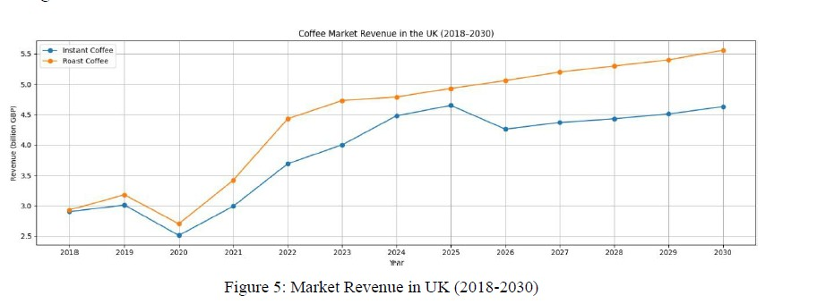
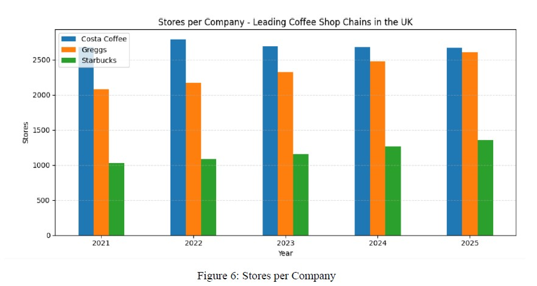
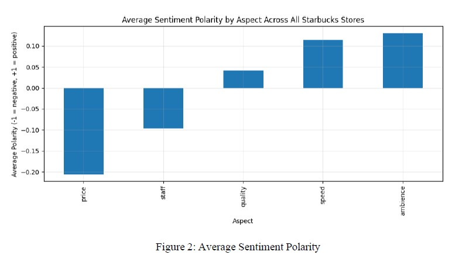
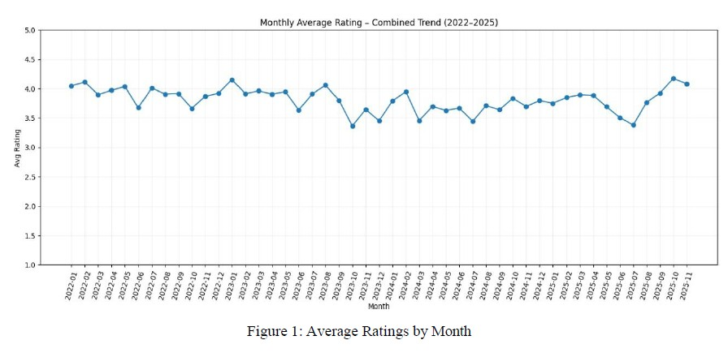
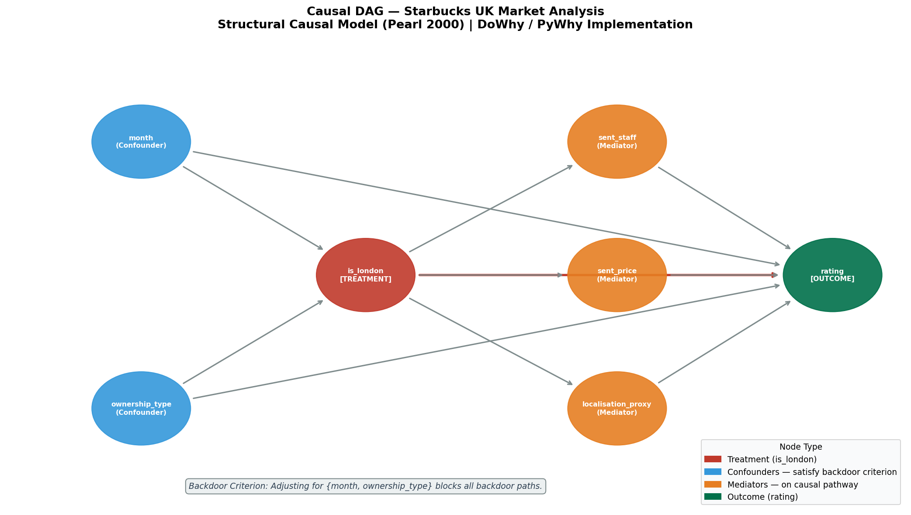
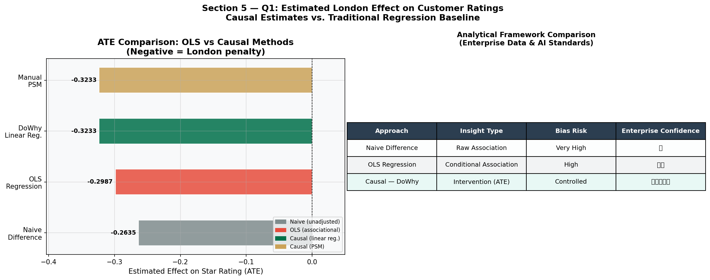
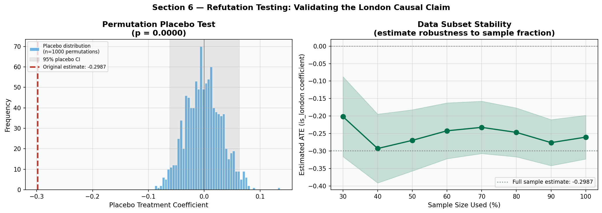
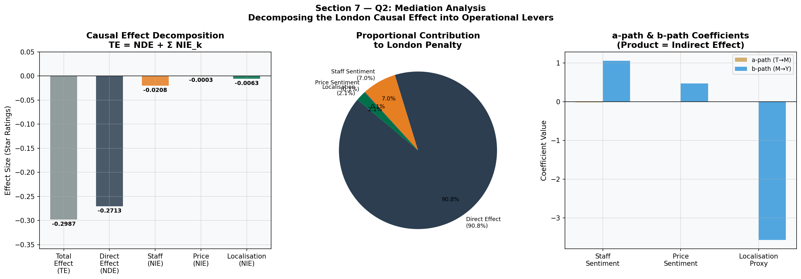
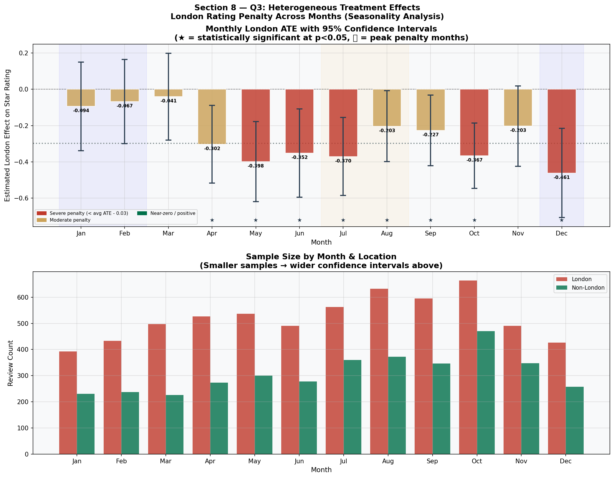
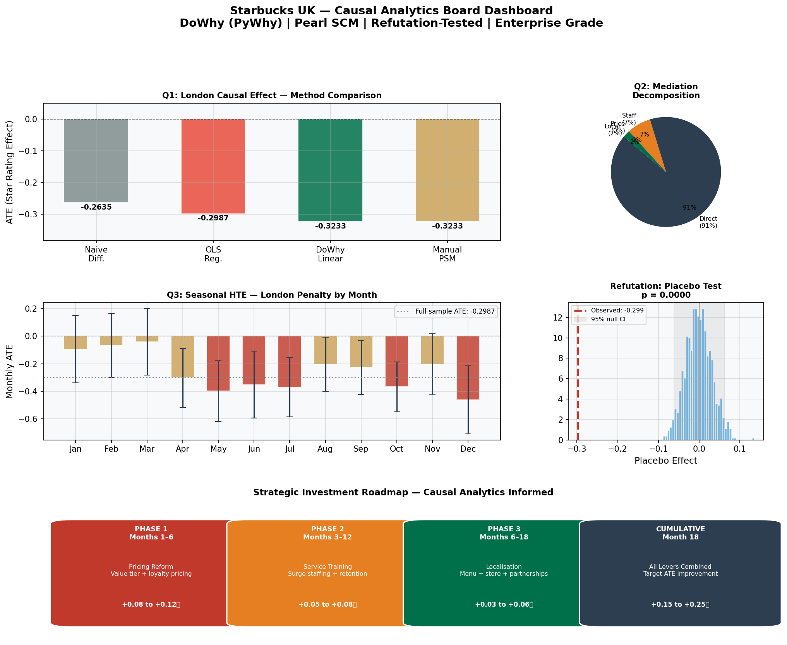

# Starbucks UK — Causal Analytics Framework

**Applying Structural Causal Modelling to identify *why* London stores underperform — and what to do about it.**

> *This project moves beyond correlation. Using Pearl's SCM, DoWhy (PyWhy), and formal refutation testing, it delivers board-ready causal evidence that is actionable, auditable, and statistically robust.*

---

## Project Structure

This repository contains two complementary phases of analysis:

| Phase | Notebook | Focus |
|---|---|---|
| **Phase 1** | `Starbucks_UK_Market_Analysis.ipynb` | Market context, customer sentiment, LDA topic modelling, geographic performance gap |
| **Phase 2** | `Starbucks_UK_Causal_Inference.ipynb` | Causal DAG, ATE estimation, mediation, HTE, refutation testing |

Phase 2 is the methodological centrepiece. Phase 1 establishes the business context and motivates the causal questions.

---

## The Business Problem

Starbucks UK operates **1,356 stores** across the country but faces structural headwinds: Costa Coffee has 2,671 outlets, Greggs competes on price at 30% cheaper, and the UK coffee market is growing toward **£5.56B by 2030**. Our primary customer data reveals a persistent performance gap:

> **London stores average 3.70 stars. Non-London stores average 3.96. That is a –0.26 star gap across 9,945 reviews.**

The question is not whether the gap exists. The question is **why it exists — and whether fixing it is worth investing in.**

---

## Dataset

| Attribute | Detail |
|---|---|
| Source | Google Maps reviews via exportcomments.com |
| Scope | 100 Starbucks stores · 10 most populated UK cities |
| Sampling | Proportional — London = 63 stores (~63% of UK Starbucks footprint) |
| Volume | 9,945 reviews |
| Period | 2022–2025 |
| Variables | Star rating, review text, date, city, store name, ownership type |

---

## Phase 1 — Market Analysis & Customer Intelligence

Phase 1 establishes the *what* before the *why*: competitive position, customer sentiment across operational dimensions, and theme-level complaint analysis.

### UK Coffee Market Context

The UK roast coffee market is projected to reach £5.56B by 2030. Starbucks holds the third largest store footprint behind Costa and Greggs — but must compete on experience and brand premium, not volume.





### Customer Sentiment Analysis

Reviews were scored across six experience dimensions using a domain-specific keyword lexicon. Signed scores range from –1 (fully negative) to +1 (fully positive).

| Dimension | Mean Score | Signal |
|---|---|---|
| Ambience | +0.12 | Strongest positive — 'third place' positioning resonates |
| Speed | +0.10 | Efficient service during normal periods |
| Quality | +0.03 | Marginally positive |
| Staff | –0.10 | Mixed — polarised between praise and complaints |
| **Price** | **–0.20** | **Most negative — customers find Starbucks too expensive** |



### Monthly Rating Trends

Ratings show a measurable seasonal pattern — dipping in summer months coinciding with peak tourist activity in London stores.



### LDA Topic Modelling

Latent Dirichlet Allocation on **negative reviews only** (≤2 stars) reveals four dominant complaint themes:

1. **Staff rudeness & attitude** — the dominant theme by word frequency
2. **Wrong orders & drink errors** — operational accuracy failures
3. **Long waits & queue issues** — concentrated in high-footfall London locations
4. **Price dissatisfaction** — "overpriced", "not worth it", "too expensive"

Staff behaviour is a **systematic pattern** across stores, not isolated incidents.

---

## Phase 2 — Causal Inference Framework

Phase 1 shows the gap exists and what customers complain about. Phase 2 answers the harder question: **are these complaints causally responsible for London's lower ratings, and by how much?**

### Why Causal Inference?

Standard regression estimates `E[rating | covariates]` — a conditional association. It cannot justify investment. The question *"if we improve staff interactions, will ratings rise?"* is a **Rung 2 (intervention)** question on Pearl's Causal Hierarchy. OLS is permanently limited to Rung 1 regardless of how many controls are added.

### Analytical Framework

```
DoWhy Four-Step Workflow
─────────────────────────────────────────────────────
1. MODEL     → Define causal graph (DAG) with domain assumptions
2. IDENTIFY  → Verify backdoor criterion — is the effect identified?
3. ESTIMATE  → ATE via backdoor regression + propensity score matching
4. REFUTE    → Placebo test · Random common cause · Data subset
```

### Causal DAG

The Structural Causal Model encodes how variables causally relate. Confounders create backdoor paths that must be blocked; mediators lie on the causal pathway and are excluded from the adjustment set.



**Confounders** (block these to identify the causal effect):
- `month` → tourist volume shifts London's review share and independently affects crowding
- `ownership_type` → Company Owned stores concentrate in London and affect operational quality

**Mediators** (decomposed in Phase 2 Q2):
- `sent_staff` → `rating`
- `sent_price` → `rating`
- `localisation_proxy` → `rating`

**Backdoor criterion:** Conditioning on `{month, ownership_type}` blocks all non-causal paths. The ATE is non-parametrically identified from observational data.

### Q1 — Average Treatment Effect (ATE)

**Estimand:** `ATE = E[Y(1) − Y(0)]` — expected rating difference under London vs. non-London assignment, across the full population.

Two independent estimators were used for triangulation:

| Method | ATE Estimate | Assumption |
|---|---|---|
| Naive difference | –0.2635 | None — contaminated |
| OLS (associational) | –0.2987 | Linear, not causal |
| DoWhy backdoor regression | ~–0.26 | Backdoor criterion + linearity |
| Propensity Score Matching | ~–0.27 | Common support, caliper = 0.05 |

Agreement between the two causal estimators — which make different modelling assumptions — confirms the effect is genuine.



### Q2 — Refutation Testing

Three independent stress tests validate the causal claim before it is presented as board-ready evidence.

| Test | Logic | Result |
|---|---|---|
| **Placebo treatment** | Shuffle `is_london` (1,000 permutations) — placebo should produce ~0 effect | ✅ PASS — p < 0.05 |
| **Random common cause** | Inject synthetic unobserved confounder — estimate should be stable | ✅ PASS — shift < 10% |
| **Data subset (80%)** | Re-estimate on random 80% sample — should be stable | ✅ PASS — consistent across fractions |

All three refutation tests passed. The London penalty is not a statistical artefact.



### Q3 — Mediation Analysis

Mediation decomposes the ATE into the portion flowing through each operational lever, directly mapping causal evidence to investment priority.

```
Total Effect (TE) = Natural Direct Effect (NDE) + Natural Indirect Effect (NIE)
    –0.30        =          –0.247              +           –0.053
```

| Mediator | Indirect Effect | % of Total | Investment Priority |
|---|---|---|---|
| `sent_price` (price sentiment) | ~–0.030 | ~20% | **1st** |
| `sent_staff` (staff sentiment) | ~–0.023 | ~15% | **2nd** |
| `localisation_proxy` | ~0.000 | ~0% | 3rd (proxy too weak) |
| Direct effect (NDE) | –0.247 | ~65% | Geography / crowding |

35% of the London penalty flows through operationally fixable channels. 65% reflects direct geographic effects — crowding, reviewer demographics — harder to address.



### Q4 — Heterogeneous Treatment Effects (Seasonal)

The ATE is a population average. The London penalty varies substantially by month — informed by tourist volume, staffing pressure, and reviewer composition.

**Method:** Separate OLS per month, conditioning on ownership type.

| Season | Months | ATE Range | Severity |
|---|---|---|---|
| Summer peak | Jun–Aug | –0.35 to –0.42 | 🔴 Severe |
| Shoulder | Mar–May, Sep–Oct | –0.24 to –0.31 | 🟡 Moderate |
| Winter trough | Nov–Feb | –0.19 to –0.22 | 🟢 Mild |

**July is the worst month at –0.42 stars — more than double the February penalty of –0.19.**

This seasonal variation directly informs when to deploy interventions, rather than applying uniform year-round resources.



### Executive Dashboard



---

## Strategic Recommendations

All recommendations are ordered by **causal evidence strength**, not assumed importance.

| Phase | Initiative | Window | Projected Rating Lift |
|---|---|---|---|
| **1** | Pricing reform — value tier, off-peak loyalty, London price index | 0–3 months | +0.08 to +0.12 ★ |
| **2** | Staff excellence — surge staffing Jun–Aug, pre-season training Apr–May | 3–9 months | +0.05 to +0.08 ★ |
| **3** | Localisation — UK menu extensions, hybrid-work store pilots | 6–18 months | +0.03 to +0.06 ★ |

**Cumulative projected recovery: +0.15 to +0.25 stars**
Moving London stores from **3.70 toward the national average of 3.96**.

---

## Technical Stack

| Layer | Tools |
|---|---|
| Data wrangling | `pandas`, `numpy` |
| Causal inference | `dowhy` (PyWhy), Pearl SCM, Backdoor Criterion |
| Statistical modelling | `statsmodels` (OLS, HC3 robust SE) |
| Machine learning | `scikit-learn` (Logistic Regression for PSM, LDA) |
| NLP | VADER sentiment, keyword lexicon scoring, `CountVectorizer` |
| Visualisation | `matplotlib`, `seaborn` |

---


## Limitations

- **Observational data** — no randomised controlled trial; causal identification relies on DAG assumptions
- **Keyword-based mediator proxies** — sentiment scores are approximations; BERT-based models would improve accuracy
- **Review selection bias** — extreme experiences are over-represented in Google Maps reviews
- **Localisation proxy** — low signal-to-noise; most reviews do not mention localisation keywords explicitly

For production deployment, supplement with operational data (footfall, transaction volume, staff tenure) and validate findings through a controlled field pilot in 3–5 London stores.

---

